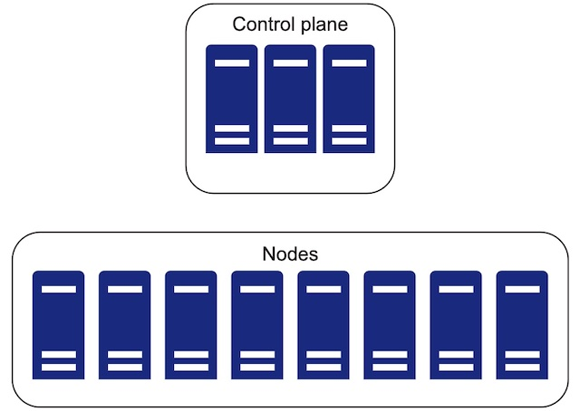

# Why Kubernetes exists


**本章涵盖：**

* Kubernetes 存在的原因
* Kubernetes 常用术语
* Kubernetes 特定用例
* Kubernetes 高级功能
* Kubernetes 不适用的场景

---
Kubernetes是一个开源平台，用于托管容器和定义以应用程序为中心的API，用于管理围绕这些容器如何通过存储，网络，安全性和其他资源来管理这些容器的基础设施。

为什么要在您的环境中实施kubernetes，而不是使用与DevOps相关的基础架构工具手动提供这些资源？

答案在于我们将DevOps定义为越来越多地集成到整个应用程序生命周期中的方式，DevOps越来越多地进化为包括流程，工程师和工具，这些工具和工具支持数据中心中更自动化的应用程序管理。成功执行此操作的关键之一是基础架构的可重复性。


## 常用术语解释

* CNI and CSI — 允许在Kubernetes中运行的Pods的容器网络和存储接口扩展自定义的网络和存储
* Container - 通常运行应用程序的Docker或OCI(Open Container Initiative) 镜像
* Control plane — Kubernetes集群的大脑，在该集群中进行了安排和管理所有Kubernetes对象（有时称为Masters）
* DaemonSet — 就像Deployment一样，但它在集群的每个节点上运行
* Deployment — 用来管理Pods 实现滚动更新

* kubectl — 与Kubernetes控制平面交互的命令行工具
* kubelet — 在集群节点上运行的Kubernetes agent 。管理容器声明周期。
* Node — 运行kubelet和容器的机器 通常所说的宿主机
* OCI — 容器定义的标准接口和规范
* Pod — Kubernetes 最小的调度单元，封装运行多个容器

## Kubernetes和变基础设施'漂移' 问题

管理基础设施是一种可再现的方法，可以将基础设施配置的“漂移”作为硬件，合规性和其他数据中心要求随时间变化而变化。这既适用于应用程序的定义以及这些应用程序运行的主机的管理。IT工程师都非常熟悉工作，例如

* 在服务器上更新Java版本
* 确保某些应用程序不会在特定的地方运行
* 应用程序从损坏的硬件或者旧的机器中进行迁移
* 手动管理负载平衡路由
* 一些语言运行时环境的强依赖忘记更新

当我们在数据中心或云中管理和更新服务器时，其原始定义从预期的IT体系结构中“消失”的几率增加了，应用程序可能在错误的位置，错误的资源分配或使用错误的存储模块运行。

Kubernetes为我们提供了一种使用一个方便的工具来管理所有应用程序：[kubectl](https://kubernetes.io/docs/tasks/tools/)，
命令行客户端，实现REST API调用到Kubernetes API服务器。我们还可以使用Kubernetes API客户端来编程执行这些任务。安装kubectl并在一个[kind](https://github.com/kubernetes-sigs/kind)管理的集群上进行测试非常容易，我们将在本书中进行。


以前管理复杂应用程序的方法包括技术Puppet, Chef, Mesos, Ansible,SaltStack。从Mesos等软件提供的一些应用程序和调度原始措施中借用概念

Ansible，saltstack和Terraform通常在基础设施配置中起着重要作用（例如防火墙或二进制安装）。Kubernetes也可以实现此功能，但是它在Linux环境上使用了特权容器（这些被称为Windows V1.22上的HostProcess Pods）。比如，Linux系统中的特权容器可以管理将iPtables规则路由到应用程序的规则，实际上，这正是Kubernetes Service Proxy（称为Kube-Proxy）所做的事情。

Google，Microsoft，Amazon，VMware和许多公司都采用了以容器作为核心，并为客户提供了在不同的云和裸露金属环境上运行数百或数千个应用程序的机器。因此，构造者是运行应用程序和管理应用基础设施（例如为容器提供为运行IP地址）的基本属性，该应用程序依赖于这些应用程序（例如 防火墙设置以及自定义存储，），最重要的是，本身运行应用程序。

Kubernetes 本质上已经成为了现代容器编排的标准，可以实现在任何云以及任何数据中心当中来管理任何服务。


## 容器和镜像

应用在主机中运行时必须要有它所需要的依赖， 在容器时代之前开发需要临时的完成这项配置。

从本质上讲，可以将Docker视为运行容器的一种方式，其中容器是运行的标准[OCI](https://github.com/opencontainers/image-spec)。OCI规范是定义可以由Docker等程序执行的镜像的标准方法，最终是具有各种层的定义，镜像中的每个层都包含Linux二进制文件和应用程序文件等内容。因此，当您运行容器时，容器运行时（例如Docker，Container或Cri-O）下载镜像，解压，并在主机系统上启动一个运行镜像的过程。

容器添加了一层隔离层，该隔离层可以证明需要在服务器上管理库或使用其他应用程序依赖性进行预加载基础设施。例如，如果您有两个Ruby应用程序需要同一库的不同版本，则可以使用两个容器。每个应用都在运行的容器中隔离，并具有所需的库的特定版本。

使用镜像与Kubernetes合并运行在不可变的服务器， 由于容器迅速成为软件应用部署的行业标准，因此值得一提的是：

Docker和Kubernetes对超过88,000名开发人员进行了使用，在2020年最受欢迎的开发技术中排名第三。

最重要的是，我们需要用于容器的自动化进行编排，这就是Kubernetes所适合的地方。Kubernetes像Oracle数据库一样统治了该领域，并且虚拟化技术在其鼎盛时期所做的。多年后，Oracle数据库和VSPHERE安装仍然存在。我们预测Kubernete的未来也是如此。


## Kubernetes 核心基础

从本质上讲，我们将Kubernetes中的所有内容通过YAML或JSON定义，并以声明性的方式为您运行您的OCI镜像。我们可以使用相同的方法（YAML或JSON文本文件）来配置网络规则，基于角色的身份验证和授权（RBAC）等。通过学习一种语法及其结构的结构，可以配置管理和优化任何Kubernetes系统

让我们看一下快速的示例，说明如何为一个简单的应用程序运行到kubernetes。不用担心;我们将有很多示例，以引导您阅读本书后期的整个申请。考虑到这是迄今为止我们已经完成的手动努力的视觉指南。为了从微服务的具体示例开始，以下代码片段生成了一个dockerfile，该码头构建了能够运行mysql的镜像：

```
FROM alpine:3.15.4
RUN apk add --no-cache mysql
ENTRYPOINT ["/usr/bin/mysqld"]

```

人们通常会构建此镜像（使用Docker构建），然后将其推到OCI注册表（使用Docker Push之类的某种东西）（在容器运行时可以由容器存储和检索的地方）。您可以在[harbor](https://github.com/goharbor/harbor)中找到一个常见的开源训练。另一种此类注册常用于全球数百万个应用程序，位于[docker hub](https://hub.docker.com/)上。对于此示例，假设我们推送已经推送成功，现在我们正在某个地方运行它。我们可能还想构建一个容器来与此服务交互（也许我们有一个自定义Python应用程序，可作为MySQL客户端）。我们可能会这样定义其Docker镜像：

```
FROM python:3.7
WORKDIR /myapp
COPY src/requirements.txt ./
RUN pip install -r requirements.txt
COPY src /myapp
CMD [ "python", "mysql-custom-client.py" ]
```

现在，如果我们想在Kubernetes环境中运行python client 和MySQL Server作为容器，我们可以通过创建两个Pod来轻松地这样做。这些Pod的每个都运行这个自的容器，比如：


```
apiVersion: v1
kind: Pod
metadata:
  name: core-k8s
  spec:
    containers:
    - name: my-mysql-server
      image: myregistry.com/mysql-server:v1.0
---
apiVersion: v1
kind: Pod
metadata:
   name: core-k8s-mysql
   spec:
    containers:
    - name: my-sqlclient
      image: myregistry.com/mysql-custom-client:v1.0
      command: ['tail','-f','/dev/null']
```

通常，我们通常会将以前的YAML内容存储在文本文件中（例如my-app.yaml），并使用Kubernetes客户端工具执行它（例如，Kubectl create -f my-app.yaml）。该工具连接到Kubernetes API服务器，并传输要存储的YAML定义。然后，kubernetes自动采用我们在API服务器上拥有的两个Pod的确定性，并确保它们在某处启动并运行。

不会立刻发生：它需要集群中的节点来响应不断发生的事件，并通过通信到API服务器的kubelet在其节点对象中更新该状态。它还要求存在OCI镜像并可以访问我们的Kubernetes群集中的节点。事情可能随时出现问题，因此我们将Kubernetes称为最终一致系统，其中随着时间的推移，所需状态的和解是关键的设计理念。该一致性模型（与保证的一致性模型相比）可确保我们可以不断要求更改我们集群中所有应用程序的总体状态空间。

现实中一个常见的方案。例如，如果您告诉Kubernetes，“我希望五个应用程序分布在云中的三个区域中”，则可以通过定义使用Kubernetes的调度安排几行YAML来实现这一点。当然，您需要确保这三个区域实际上存在并且您的调度程序知道它们，但是即使您没有这样做，Kubernetes至少也会调度在可用区域上。

简而言之，Kubernetes允许您定义集群中所有应用程序的所需状态，它们的网络方式，运行的方式，使用什么存储等等，同时将这些详细信息的基本实现委派给Kubernetes本身。因此，您很少会发现需要在kubernetes场景中进行一次性的Ansible或Puppet更新（除非您重新安装Kubernetes本身，即使那样，诸如cluster api之类的工具也允许您使用要使用kubernetes进行管理kubernetes。


### Kubernetes中的所有基础设施规则都可以通过普通YAML实行进行管理

Kubernetes 使用Kubernetes API 自动化进行管理所有技术栈，可以完全作为YAML和JSON资源操作。这包括传统的IT基础设施定义（仍然以某种方式或其他方式适用于微服务），例如：
* 服务通过端口或IP 进行路由
* 对于应用程序持久化存储的可用性
* 在特定或任意的服务器上托管软件
* 安全方面 例如为应用程序访问的应用程序可设置的网络规则
* 针对全局或者某个应用程序设置DNS配置


所有这些组件都是在配置文件中定义的，这些文件是Kubernetes API中对象的定义。Kubernetes通过应用更改，监视这些更改并解决瞬时失败或中断，直到达到所需的最终状态，以使用这些构建块和构成。当“夜晚的事情变得颠簸”时，Kubernetes会自动处理很多场景，而我们不必自己解决问题。正确配置使用自动化的更精致的系统可以使DevOps团队专注于解决复杂的问题，为未来计划以及为企业找到一流的解决方案。接下来，让我们回顾一下Kubernetes提供的功能以及它们如何支持Pod的使用。


## Kubernetes 特性

容器编排平台使开发人员可以自动化运行实例，配置主机，链接容器以优化编排程序以及扩展应用程序生命周期的过程。是时候在容器编排平台中潜入核心功能了，因为从本质上讲，容器需要Pod和Pod需要kubernetes。

* 暴漏所有功能API到API server
* 与Kubernetes Controller Manager（也称为KCM）中的所有主要云和管理程序平台集成

* 提供故障自愈的框架用于应用程序、存储和数据中心配置的状态或其他基础设施等

* 管理应用部署，同时最大程度地减少面向用户的停机时间，无论是单个主机，服务还是应用程序

* 实现内部和外部访问负载均衡集成（称为clusterip，nodeport或Load Balancer Service类型）

* 提供应用程序可以调度到特定的Node

* 通过Daemonset 部署可以部署到集群所有Node上

* 允许通过Kube DNS和最近由Coredns实施的域名服务（DNS）进行服务发现，该服务与API服务器集成在一起

* 包括API扩展名并使用自定义资源实现定义构建符合业务需求程序

* 可以通过Kubectl exec和Kubectl Descript检测任何失败的资源包含整个过程，包括远程执行到任何容器中。

* 允许将本地和/或远程存储安装到容器上，并管理具有Storageclass API和PersistentVolumes的容器的声明存储量

Kubernetes的作用绝不是微不足道的。它标准化了在同一集群中或在同一集群中运行的多个应用程序的生命周期管理。Kubernetes的基础是由节点组成的集群。诚然，Kubernetes的复杂性是工程师对Kubernetes的抱怨之一。社区正在努力使其更容易，这是Kubernetes正在解决一个复杂的问题。

<center></center><br />

如果您不需要高可用性，可扩展性和编排能力，那么也许您不需要Kubernetes。现在，让我们考虑一个集群中的典型故障情况：

* 一个节点心跳停止响应到Master

* Node 出现网络延迟 Master降这个Node上的Pod重新调度到新的Node上

* 当用户通过kubectl将API调用到API server中时，API server以有关未响应的节点和PodS的新位置的正确信息进行响应

* 所有的客户端与Pod 的Service 进行交互都会路由到新的地址

* 失败节点上的Pods附加的存储量移至新的Pod位置，以使其旧数据仍然可读

这本书的目的是使您更深入了解所有这些如何真正在底层运作，以及基础Linux 低层如何补充高级Kubernetes组件以完成这些任务。Kubernetes在很大程度上依赖Linux堆栈中的技术，这些技术通常很难学习并且缺乏深厚的文档。我们希望通过阅读这本书，您会了解许多Kubernetes的微妙之处，这些细微之处在工程师首次使用的教程中经常被忽略

在不变的操作系统上运行Kubernetes是很自然的。您有一个基本操作系统，仅在更新整个操作系统时才更新（因此是不可变的），然后使用该操作系统安装节点/kubernetes。运行不变的操作系统有许多优势，我们在这里不会介绍。您可以在云中，裸金属服务器，甚至在Raspberry Pi上运行Kubernetes。实际上，美国国防部目前正在研究如何在其一些战斗机上运行Kubernetes。IBM甚至支持在其下一代大型机上运行集群，PowerPCS


随着Kubernetes周围的云本地生态系统持续完善和成熟，它将继续允许组织确定最佳实践，主动进行更改以防止问题，并保持环境的一致性，以避免‘漂移’，其中一些机器与其他机器的行为略有不同因为补丁是有差异的错过，未应用或不适当地应用

## Kubernetes 组件架构实现

现在，让我们花点时间看一下高级别的Kubernetes架构。简而言之，它由您的硬件和运行Kubernetes控制平面的硬件的部分组成以及Kubernetes Worker Nodes：

<center></center><br />

* 硬件设施: 包括计算机，网络基础架构，存储基础架构和容器镜像仓库
* Kubernetes worker nodes: Kubernetes集群中计算的基本单位，用来调度Pood运行容器
* Kubernetes control plane: Kubernetes 大脑，API-server、scheduler、controller-manager


### Kubernetes API

如果本章有一件重要的事情要使您能够在本书中进行深入的旅程，那么在Kubernetes平台上管理微服务和其他容器化软件应用程序只是宣布Kubernetes API对象的问题。在大多数情况下，其他一切都为您完成

这本书将深入研究API服务器及其数据存储等。您几乎可以要求Kubectl在API server中使用定义和版本的对象进行读取或写作。（此类例外是使用kubectl捕获运行pod的日志，其中该连接被代理到节点。）kube-apiserver（kubernetes api server）允许CRUD（创建，读取，读取，更新和删除））在所有对象上操作，并提供一个恢复的（表示状态传输）接口。一些kubectl命令（例如describe）是多个对象的复合视图。通常，所有kubernetes api对象都有:

* API version (比如v1或者rbac.authorization.k8s.io/v1)
* kind（比如kind: Deployment）
* 元数据 (metadata)


我们可以感谢Kubernetes最初的创始人之一Brian Grant的API验证计划，该计划随着时间的推移而被证明是健壮的。这似乎很复杂，坦率地说，有时会有些痛苦，但是它使我们能够做诸如定义API变化的升级和合同之类的事情。API的变化和迁移通常是不平凡的，Kubernetes为API更改提供了明确定义的合同。查看Kubernetes网站API版本的定义。

在本书的整章中，我们将重点关注Kubernetes，但继续返回基本主题：Kubernetes中的所有内容都存在于支持Pod。在本书中，我们将详细研究几个API元素

* 部署和运行Pods
* API 实现细节
* Ingress Services 和负载均衡
* PersistentVolumes 和 PersistentVolumeClaims 存储
* 网络策略 和 网络安全

您可以在标准的Kubernetes集群中使用，创建，编辑和删除大约70种不同的API类型。您可以通过运行kubectl api-Resources查看这些内容。输出应该看起来像这样：

```
$ kubectl api-resources | head
NAME SHORTNAMES NAMESPACED KIND
bindings true Binding
componentstatuses cs false ComponentStatus
configmaps cm true ConfigMap
endpoints ep true Endpoints
events ev true Event
limitranges limits true LimitRange
namespaces ns false Namespace
nodes no false Node
persistentvolumeclaims pvc true PersistentVolumeClaim

```

我们可以看到，Kubernetes本身的每个API资源都有：

* 一个简单的名字
* 一个全名
* 表明它的作用域是否是namespace级别

在kubernetes中，namespace允许特定内部存在某些对象。这为开发人员提供了一种简单的分层分组形式。比如，如果您的应用程序运行了10种不同的微服务，则通常可能创建所有这些Pod，服务和PersistentVolumeClial（也称为PVCS），在同一名称空间内。这样，当您该删除应用程序时，您只需删除名称空间即可。在第15章中，我们将研究分析应用程序生命周期的高级方法，这些方法比这种简单的方法更为先进。但是在许多情况下，namespace是分离与应用程序关联的所有Kubernetes API对象的最明显和直观的解决方案。

### 示例一：在线零售商

想象一下，一家主要的在线零售商需要能够随着季节性的需求而快速扩展，例如假期。扩展和预测如何扩展一直是他们最大的挑战之一 - 也许是最大的挑战。Kubernetes解决了运行高度可扩展的分布式系统所带来的许多问题。想象一下具有缩放，分发和使高度可用系统的能力的可能性。这不仅是经营业务的更好方法，而且还是管理系统管理最有效的平台。在组合Kubernetes和云服务商时，您可以在需要额外资源的情况下运行其他人的服务器，而不是购买和维护额外的硬件，以防万一


### 示例二：在线捐赠解决方案

对于值得一提的这一过渡的第二个真实示例，让我们考虑一个在线捐赠网站，该网站可以根据用户的选择为广泛的慈善机构提供贡献。假设这个特定的示例最初是一个WordPress站点，但最终，业务交易导致对JVM Frameworks（如Grails）的全面依赖性，并具有自定义的UX，中间层和数据库层。该业务要求包括机器学习，广告服务，消息传递，Python，Lua，nginx，PHP，Mysql，Mysql，Cassandra，Redis，Redis，Etalastic，Activemq，Spark，Spark，Lions，Lions，Tigers，Tigers和Bears。。。并到此为止。

最初的基础架构是一种手工建造的云虚拟机（VM），使用Puppet来设置所有内容。随着公司的发展，他们为规模设计，但这包括越来越多的VM，仅托管了一两个应用程序。然后他们决定搬到Kubernetes。VM计数从30左右减少到5左右，并更容易缩放。他们完全消除了Puppet和服务器的设置，因此需要手动管理机器基础设施，这要归功于它们的大量使用Kubernetes

该公司向Kubernetes的过渡解决了整个VM管理问题，DNS的复杂服务出版负担等等。此外，从基础设施的角度来看，灾难性失败的情况下的恢复时间更为可预测。当您体验到运转良好的标准化API驱动方法并有能力快速进行大规模更改的好处时，您开始感谢Kubernetes的声明式及其对容器编排的云原生方法


## 不适合Kubernetes

当然，在某些情况下，Kubernetes可能不合适所有场景。其中一些包括：

* 高性能计算（High-performance computing ） - 使用容器增加了一层复杂性，并且随着新层的性能命中。使用container创建的延迟越来越小，但是如果您的应用程序受纳米或微秒的影响，使用kubernetes可能不是最好的选择。

* Legacy-某些应用程序具有硬件，软件和延迟要求，使其很难简单地容器化。例如，您可能会从一家软件公司购买的应用程序，该公司不会正式支持在容器中运行或在Kubernetes集群中运行其应用程序。

* Migration- 传统系统的实施可能是如此僵化，以至于将它们迁移到Kubernetes，除了“我们建立在Kubernetes上”之外，几乎没有其他优势。但是，当单片应用程序被解析为逻辑组件时，一些最重要的收益会在迁移之后产生，然后可以彼此独立扩展

这里重要的是：学习并掌握基础知识。Kubernetes以稳定，具有成本敏感的方式解决了本章中提出的许多问题。

## 总结

* kubernetes使您的生活更轻松！
* Kubernetes平台可以在任何类型的基础架构上运行。
* Kubernetes建立了共同工作的组件的生态系统。组合组件可以使公司能够预防，恢复和扩展，并在需要紧急更改时实时进行更新。
* 可以使用一个简单的工具来完成您在Kubernetes中所做的一切：Kubectl。

* Kubernetes从一台或多台计算机创建了一个集群，该集群为部署和主机容器提供了一个平台。它提供容器编排，存储管理和分布式网络。
* Kubernetes是从以前以配置驱动的以及容器驱动的方法诞生的。

* Pod 是Kubernetes的基本构建单元。它支持Kubernetes允许的无数特性：扩展，故障转移，DNS查找和RBAC安全规则。

* Kubernetes应用程序完全通过简单地调用Kubernetes API服务器来管理。
