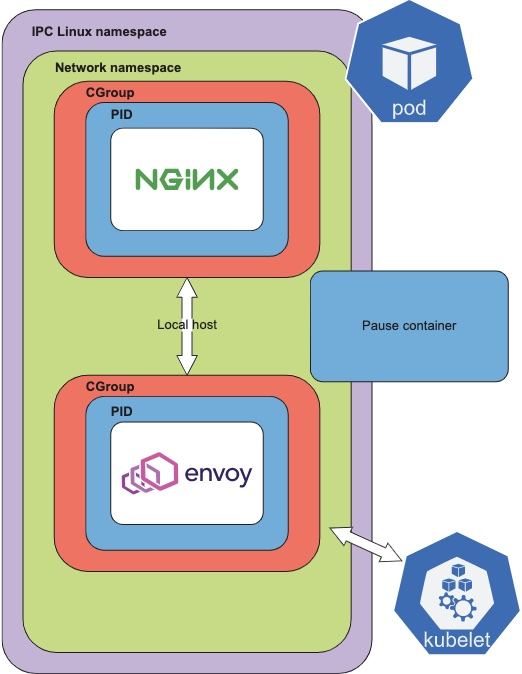
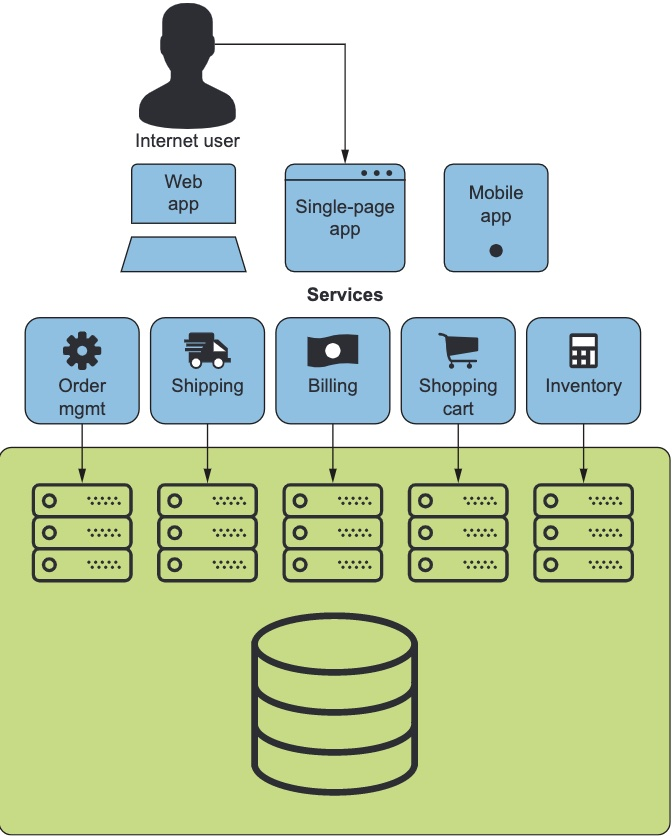

# Why the Pod?
 

**本章涵盖：**

* 什么是Pod ？
* 为什么我们需要Pod ？
* Kubernetes 如何构建Pod
* Kubernetes 控制面


在上一章中，我们提供了Kubernetes的高级概述，并介绍了其功能，核心组件和体系结构。我们还展示了一些业务用例，并概述了一些容器定义。Kubernetes Pod抽象以灵活的方式运行数千个容器一直是企业中过渡到容器的基本部分。在本章中，我们将介绍Pod以及如何建立Kubernetes作为基本应用程序构建块支持它

正如第1章中简要提到的那样，Pod是在Kubernetes API中定义的对象，Kubernetes中的大多数内容也是如此。Pod是可以部署到Kubernetes集群的最小原子单元，而Kubernetes围绕Pod定义构建。Pod允许我们定义一个可以包含多个容器的对象，该对象允许Kubernetes创建一个或多个在节点上托管的容器

<center></center><br />

许多其他Kubernetes API对象要么直接使用Pod，要么是支持Pod的API对象。例如，Deployment使用Pod，以及StatefulSets和DaemonSets。几个不同的高级Kubernetes控制器创建和管理Pod生命周期。控制器是在控制平面上运行的基础组件。内置控制器的示例包括控制器管理器，云管理器和调度程序。但是首先，让我们通过布置Web应用程序，然后将其协调到Kubernetes，Pod和控制平面。

```
NOTE：
您可能会注意到，我们使用控制平面定义运行控制器，controller  manager和scheduler的节点组。它们也被称为Master，但是在本书中，我们将在谈论这些组件时使用control plane

```

## web application

让我们浏览一个示例Web应用程序，以了解为什么我们需要一个Pod以及如何构建Kubernetes来支持Pod和容器化的应用程序。为了更好地了解Pod是什么，我们将在本章的大部分时间内使用以下示例。


Zeus ZAP Energy Drink Company拥有一个在线网站，该网站允许消费者购买其不同的碳酸饮料。该网站由三个不同的层组成：用户界面（UI），中间层（各种微服务）和后端数据库。他们还具有消息传递和队列协议。像Zeus ZAP这样的公司通常具有各种Web前端，包括面向消费者和公司内部系统，构成中间层的不同微服务以及一个或多个后端数据库。这是Zeus Zap的Web应用程序的一个分层：

* Nginx提供的JavaScript前端
* 两个网络控制层是python微服务，托管了django
* 后端数据库CockroachDB提供端口6379

<center></center><br />


